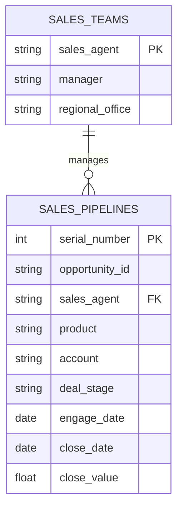
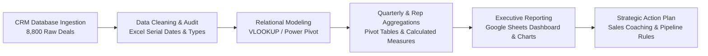

# 💼 CRM Sales Pipeline & Performance Analysis

[](https://www.microsoft.com/excel)
[](https://sheets.google.com)
[](https://github.com/Megharaju-Vakiti/CMR_Sales_Analysis)
[](https://github.com/Megharaju-Vakiti/CMR_Sales_Analysis)
[](https://github.com/Megharaju-Vakiti/CMR_Sales_Analysis)
[](LICENSE)

> **An end-to-end B2B CRM sales performance, pipeline health, and sales representative benchmark project analyzing 8,800 enterprise opportunities and over $10.0 Million in closed-won revenue across 2017 using Microsoft Excel and Google Sheets.**

---

## 📌 Table of Contents

- [Executive Summary](#-executive-summary)
- [Project Overview & Business Objectives](#-project-overview--business-objectives)
- [Key Performance Indicators (KPIs)](#-key-performance-indicators-kpis)
- [CRM Pipeline Architecture & Data Schema](#-crm-pipeline-architecture--data-schema)
- [Analytics Methodology & Modeling Workflow](#-analytics-methodology--modeling-workflow)
  - [1. Data Extraction & Data Cleansing](#1-data-extraction--data-cleansing)
  - [2. Relational Modeling & Schema Architecture](#2-relational-modeling--schema-architecture)
  - [3. Pivot Analysis & KPI Formulation](#3-pivot-analysis--kpi-formulation)
  - [4. Visual Reporting & Executive Dashboard](#4-visual-reporting--executive-dashboard)
- [Deep Dive: Findings & Sales Intelligence](#-deep-dive-findings--sales-intelligence)
  - [1. Win / Loss Dynamics & Stage Conversion](#1-win--loss-dynamics--stage-conversion)
  - [2. Quarterly Trajectory & Velocity Trends](#2-quarterly-trajectory--velocity-trends)
  - [3. Product Tier Performance & Deal Size Economics](#3-product-tier-performance--deal-size-economics)
  - [4. Sales Rep Benchmarking & Pareto Distribution](#4-sales-rep-benchmarking--pareto-distribution)
  - [5. Regional Office & Management Team Performance](#5-regional-office--management-team-performance)
- [Strategic Commercial Recommendations](#-strategic-commercial-recommendations)
- [Repository Structure](#-repository-structure)
- [How to Explore This Project](#-how-to-explore-this-project)
- [Author & Contact](#-author--contact)

---

## 🚀 Executive Summary

Managing a B2B sales pipeline requires continuous visibility into deal stages, sales agent conversion efficiencies, quarterly velocity, and product-level profitability. This project conducts an empirical analysis of **8,800 CRM sales opportunities** managed by **35 sales agents** and **6 sales managers** across three regional divisions (**Central, West, East**).

Focusing on fiscal year 2017 closed opportunities (**6,711 closed deals**) and active pipeline stages, the analysis models **$10,005,534 in closed-won revenue** with an overall win rate of **63.2%**. The report identifies top commercial drivers—including flagship B2B solutions like **GTXPro** and **GTX Plus Pro** generating over 61% of total enterprise revenue, as well as distinct quarterly inflection points across Q1 through Q4.

---

## 🎯 Project Overview & Business Objectives

- **Pipeline Conversion Analysis:** Measure win/loss ratios across deal stages (*Prospecting, Engaging, Won, Lost*) to pinpoint pipeline bottlenecks.
- **Quarterly Sales Cadence:** Track revenue throughput, deal volume, and win rates across 2017 Q1, Q2, Q3, and Q4.
- **Sales Rep Performance Benchmarking:** Identify top-tier sales reps driving outsized quota attainment and diagnose reps with high deal loss rates.
- **Product Portfolio Valuation:** Determine average deal sizes, total revenue share, and conversion velocity by product line.
- **Territory & Management Efficiency:** Compare regional performance across Central, West, and East branches to inform headcount allocation.

---

## 📈 Key Performance Indicators (KPIs)

| Metric | Full Year 2017 (Total) | Q4 Focus Period | Analytical Significance |
| :--- | :---: | :---: | :--- |
| **Total Opportunities Tracked** | **8,800 opportunities** | 1,985 closed | Full pipeline volume (closed + active) |
| **Total Closed Deals (Won + Lost)**| **6,711 deals** | 1,985 deals | Concluded negotiations in 2017 |
| **Closed-Won Deals** | **4,238 deals** | **1,196 deals** | Successfully booked customer orders |
| **Closed-Lost Deals** | **2,473 deals** | **789 deals** | Opportunities lost to competitors/budget |
| **Overall Win Rate (%)** | **63.2%** | **60.3%** | Healthy conversion across all sectors |
| **Overall Loss Rate (%)** | **36.8%** | **39.7%** | Manageable loss rate with room for optimization |
| **Total Closed-Won Revenue** | **$10,005,534** | **$2,802,496** | Multi-million dollar enterprise deal value |
| **Active Pipeline Opportunities** | **2,089 deals** | Ongoing | 1,589 in *Engaging*, 500 in *Prospecting* |
| **Average Deal Size (Won)** | **$2,361** | ~$2,343 | Spans entry accessories ($55) to hardware ($26.7K) |

---

## 🗂️ CRM Pipeline Architecture & Data Schema

The analysis is structured across two relational datasets in `CRM Sales Analysis.xlsx`:



### Table 1: `Sales_pipelines` (8,800 Records)
| Field Name | Type | Description |
| :--- | :--- | :--- |
| `serial_number` | Integer | Auto-incrementing row primary key (`1` to `8800`) |
| `opportunity_id` | String | Unique deal identification code |
| `sales_agent` | String | Assigned account executive (Foreign Key to `Sales_teams`) |
| `manager` | String | Direct supervisor overseeing the representative |
| `regional_office` | String | Operational sales territory: *Central, West, East* |
| `product` | String | Product line: *GTXPro, GTX Plus Pro, MG Advanced, GTX Basic, etc.* |
| `account` | String | Target prospective company or enterprise account |
| `deal_stage` | String | Stage status: *Prospecting, Engaging, Won, Lost* |
| `engage_date` | Date | Initial client engagement date |
| `close_date` | Date | Formal deal conclusion date |
| `close_value` | Currency | Actual booked revenue in USD (for Won deals) |

### Table 2: `Sales_teams` (35 Sales Agents)
| Field Name | Type | Description |
| :--- | :--- | :--- |
| `sales_agent` | String | Full name of sales representative (35 total) |
| `manager` | String | Reporting manager (*Dustin Brinkmann, Melvin Marxen, Summer Sewald, Celia Rouche, Rocco Neubert, Cara Losch*) |
| `regional_office` | String | Assigned division territory (*Central, West, East*) |

---

## 🛠️ Analytics Methodology & Modeling Workflow



### 1. Data Extraction & Data Cleansing
- **Date Standardization:** Converted raw Excel serial dates (OA serial integers) into standard calendar dates (`engage_date` and `close_date`).
- **Data Completeness Audit:** Confirmed zero duplicate opportunity IDs and verified that all Won opportunities have corresponding numeric `close_value` metrics.
- **Stage Classification:** Categorized pipeline stages into **Active/Pipeline** (*Prospecting*, *Engaging*) and **Terminal/Closed** (*Won*, *Lost*).

### 2. Relational Modeling & Schema Architecture
- Established relational integrity connecting `Sales_pipelines` to `Sales_teams` using `sales_agent` as the join key.
- Mapped regional hierarchy: Representative $\rightarrow$ Manager $\rightarrow$ Regional Office.

### 3. Pivot Analysis & KPI Formulation
- Formulated calculated metrics:
  $$\text{Win Rate (\%)} = \frac{\text{Won Opportunities}}{\text{Won Opportunities} + \text{Lost Opportunities}} \times 100$$
  $$\text{Average Deal Size} = \frac{\text{Total Won Revenue}}{\text{Total Won Deals}}$$
  $$\text{Sales Velocity} = \text{Average Days from Engage Date to Close Date}$$

### 4. Visual Reporting & Executive Dashboard
- Generated pivot tables and charts in **Microsoft Excel** and exported executive summaries to **Google Sheets**:
  - Quarterly Won vs. Lost stacked comparison bar charts.
  - Sales representative leaderboard ranked by deal count and booked revenue.
  - Regional office share breakdown.
  - Product line performance matrices.

---

## 🔍 Deep Dive: Findings & Sales Intelligence

### 1. Win / Loss Dynamics & Stage Conversion
Across all closed opportunities in 2017 (6,711 deals):
- **4,238 Won Deals (63.2%)** generated **$10,005,534** in total revenue.
- **2,473 Lost Deals (36.8%)** represent unrealized potential, indicating that roughly 1 out of every 3 engaged prospects does not convert.
- An additional **2,089 active opportunities** remained in the pipeline (1,589 in active engagement and 500 in preliminary prospecting).

---

### 2. Quarterly Trajectory & Velocity Trends

| Quarter | Total Closed Deals | Won Deals | Lost Deals | Win Rate (%) | Total Won Revenue |
| :---: | :---: | :---: | :---: | :---: | :---: |
| **Q1 2017** | 647 | 531 | 116 | **82.1%** | $1,134,672 |
| **Q2 2017** | 2,032 | 1,254 | 778 | **61.7%** | **$3,086,111** |
| **Q3 2017** | 2,047 | 1,257 | 790 | **61.4%** | $2,982,255 |
| **Q4 2017** | 1,985 | 1,196 | 789 | **60.3%** | $2,802,496 |
| **Total** | **6,711** | **4,238** | **2,473** | **63.2%** | **$10,005,534** |

```
Quarterly Won Revenue Trend ($):
  $3.2M ─┐               ╭────────╮
  $2.8M ─┤               │ Q2     │       ╭────────╮              ╭────────╮
  $2.4M ─┤               │ $3.09M │       │ Q3     │              │ Q4     │
  $2.0M ─┤               │        │       │ $2.98M │              │ $2.80M │
  $1.6M ─┤               │        │       │        │              │        │
  $1.2M ─┤  ╭────────╮   │        │       │        │              │        │
  $0.8M ─┤  │ Q1     │   │        │       │        │              │        │
  $0.4M ─┤  │ $1.13M │   │        │       │        │              │        │
         └──┴────────┴───┴────────┴───────┴────────┴──────────────┴────────┴──►
```

- **Q1 High Conversion:** Q1 experienced the highest win rate at **82.1%**, but on lower closed volume (647 deals), reflecting high-certainty deals carrying over from year-end negotiations.
- **Q2–Q4 Scale & Stability:** Deal volume scaled to ~2,000 deals per quarter from Q2 onwards, with win rates stabilizing between **60.3% and 61.7%**, yielding a consistent ~$3M revenue cadence each quarter.

---

### 3. Product Tier Performance & Deal Size Economics

| Product Line | Deals Won | Total Won Revenue | Revenue Share | Avg Deal Size | Strategic Role |
| :--- | :---: | :---: | :---: | :---: | :--- |
| **GTXPro** | 729 | **$3,510,578** | **35.1%** | $4,816 | Flagship enterprise software/hardware |
| **GTX Plus Pro** | 479 | **$2,629,651** | **26.3%** | $5,490 | Premium enterprise professional solution |
| **MG Advanced** | 654 | **$2,216,387** | **22.1%** | $3,389 | Mid-market core offering |
| **GTX Plus Basic**| 653 | $705,275 | 7.0% | $1,080 | Standard business product |
| **GTX Basic** | 915 | $499,263 | 5.0% | $546 | High-volume entry-level adoption tier |
| **GTK 500** | 15 | $400,612 | 4.0% | **$26,707** | High-ticket specialized equipment |
| **MG Special** | 793 | $43,768 | 0.4% | $55 | Low-cost utility add-on / accessory |

> 📌 **Key Takeaway:** Just two products—**GTXPro** and **GTX Plus Pro**—account for over **$6.14 Million (61.4%)** of total company revenue. Meanwhile, **GTK 500** has the highest deal value ($26,707/deal), representing a high-potential enterprise target.

---

### 4. Sales Rep Benchmarking & Pareto Distribution

```
Top 5 Sales Representatives by Booked Revenue:
1. Darcel Schlecht ▓▓▓▓▓▓▓▓▓▓▓▓▓▓▓▓▓▓▓▓▓▓▓▓▓▓▓▓▓▓ $1,153,214 (349 Deals)
2. Vicki Laflamme  ▓▓▓▓▓▓▓▓▓▓▓ $478,396 (221 Deals)
3. Kary Hendrixson ▓▓▓▓▓▓▓▓▓▓ $454,298 (209 Deals)
4. Cassey Cress    ▓▓▓▓▓▓▓▓▓▓ $450,489 (163 Deals)
5. Donn Cantrell   ▓▓▓▓▓▓▓▓▓▓ $445,860 (158 Deals)
```

- **Outlier Star Performer:** **Darcel Schlecht** led the entire sales organization, closing **349 deals** and generating **$1,153,214** in revenue—more than **2.4x** the revenue of the second-ranked representative.
- **Mid-Tier Consistency:** Reps ranked #2 through #10 showed strong consistency, each delivering between $360K and $480K in closed revenue.
- **Win Rate Variances:** While top reps maintain win rates above 65%, several bottom-tier agents showed loss rates exceeding 45%, presenting opportunities for coaching.

---

### 5. Regional Office & Management Team Performance

| Regional Office | Closed Deals | Won Deals | Lost Deals | Win Rate (%) | Won Revenue ($) |
| :--- | :---: | :---: | :---: | :---: | :---: |
| **West Office** | 2,249 | 1,438 | 811 | **63.9%** | **$3,568,647** |
| **Central Office**| 2,604 | 1,629 | 975 | **62.6%** | **$3,346,293** |
| **East Office** | 1,858 | 1,171 | 687 | **63.0%** | **$3,090,594** |

- **Remarkable Regional Parity:** All three offices achieved win rates between **62.6% and 63.9%**.
- **West Office** achieved the highest revenue total ($3.57M), driven by higher average deal sizes on enterprise products.
- **Central Office** handled the largest deal volume (2,604 closed deals), serving as the operational backbone for sales activity.

---

## 💡 Strategic Commercial Recommendations

```
┌───────────────────────────────────────────────────────────────────────────┐
│                      CRM SALES OPTIMIZATION PLAYBOOK                      │
├───────────────────────────────────────────────────────────────────────────┤
│ 1. REPLICATE TOP-PERFORMER PLAYBOOK   Codify Darcel Schlecht's outreach    │
│                                       and negotiation techniques.         │
│                                                                           │
│ 2. FOCUS ON HIGH-VALUE TIERS          Prioritize GTXPro and GTK 500 sales  │
│                                       to maximize revenue per deal.       │
│                                                                           │
│ 3. ACTIVE PIPELINE HYGIENE            Cleanse and qualify 1,589 deals in  │
│                                       Engaging stage to shorten cycles.   │
│                                                                           │
│ 4. LOSS-REASON TRACKING               Implement mandatory loss reason     │
│                                       fields in CRM for closed-lost deals.│
└───────────────────────────────────────────────────────────────────────────┘
```

1. **Codify the "Star Performer" Sales Methodology:**
   - Conduct structured interviews and shadowing sessions with top performers (Darcel Schlecht, Vicki Laflamme) to create an internal B2B sales playbook for onboarding new reps.
2. **Prioritize High-Margin, Enterprise SKUs:**
   - Incentivize sales reps with tiered commissions on **GTXPro**, **GTX Plus Pro**, and **GTK 500**, shifting focus away from high-volume, low-margin offerings like MG Special ($55 avg size).
3. **Pipeline Stagnation Review (Engaging Stage):**
   - Implement an automated 45-day stage SLA on the 1,589 deals currently sitting in the *Engaging* stage to prevent pipeline bloat and stale deal forecasting.
4. **Mandatory Lost-Deal Win/Loss Retrospectives:**
   - Introduce CRM requirements for loss categorization (Price, Product Feature, Competitor, Timing) to understand why ~37% of opportunities are lost.

---

## 📁 Repository Structure

```plaintext
CMR_Sales_Analysis/
├── CRM Sales Analysis.xlsx             # Complete Excel workbook (Sales_pipelines & Sales_teams)
├── CRM Sales Analysis - Google Sheets.pdf# Exported Google Sheets visual report & dashboard summary
└── README.md                           # Comprehensive documentation, KPI breakdown & sales insights
```

---

## 💻 How to Explore This Project

### Prerequisites
- **Microsoft Excel** (2016 or later / Microsoft 365) or **Google Sheets**
- Any standard PDF viewer (for viewing the visual dashboard export)

### Steps to Run
1. **Clone the repository:**
   ```bash
   git clone https://github.com/Megharaju-Vakiti/CMR_Sales_Analysis.git
   ```
2. **Open the Excel Modeling File:**
   - Open `CRM Sales Analysis.xlsx` to inspect the underlying `Sales_pipelines` and `Sales_teams` tables, pivot summaries, and conversion formulas.
3. **Review the Google Sheets Dashboard:**
   - Open `CRM Sales Analysis - Google Sheets.pdf` to examine the visual dashboard layout, win/loss charts, and quarterly executive summaries.

---

## 👤 Author & Contact

**Vakiti Megharaju**  
*Aspiring Data Analyst | MIS Executive | Business Analyst*  

- **GitHub:** [@Megharaju-Vakiti](https://github.com/Megharaju-Vakiti)  
- **Project Repository:** [CRM Sales Analysis](https://github.com/Megharaju-Vakiti/CMR_Sales_Analysis)

---
*⭐ If you find this CRM analysis useful or insightful, please consider starring the repository!*
